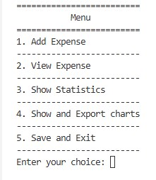
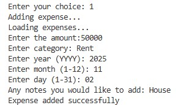
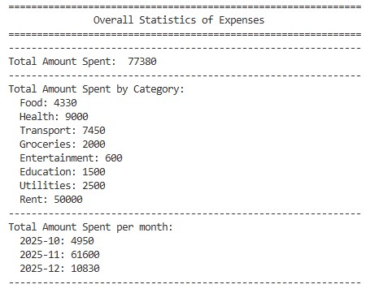
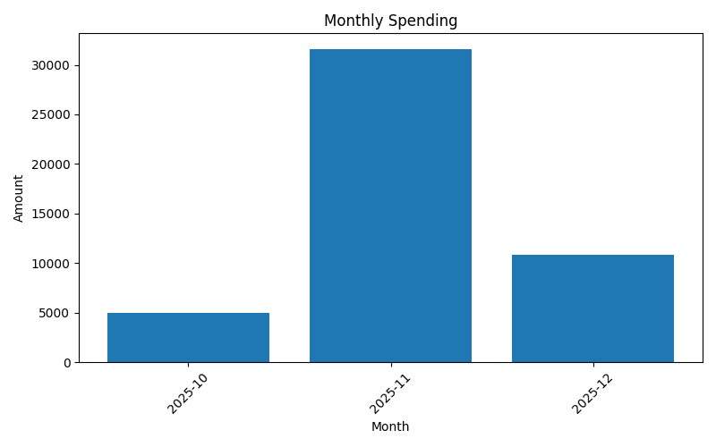
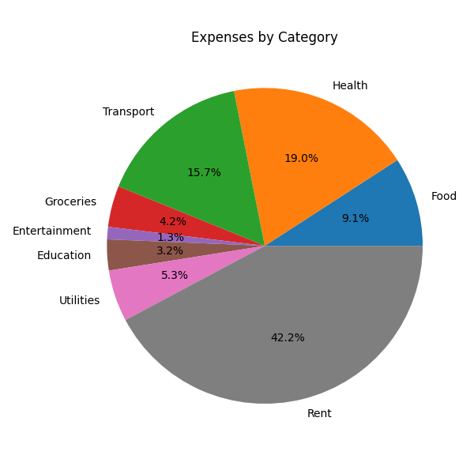

# personal-finance-tracker

A simple command-line tool to record and monitor your daily spending.

## Core Features
- **Add Expense:** Enter the amount, category, date, and an optional note.

- **View Expenses:** Display all stored expenses in a clean list.  

- **Show Statistics:** View basic spending stats like totals and summaries. 

 

- **Exit:** Saves everything to your JSON file before closing.

Expenses are stored in a JSON file using four main fields (`amount`, `category`, `date`, `note`) and handled through the project’s core Python methods.

---

## New Features (Phase 2)
- **Monthly Spending:** Automatically groups and totals expenses by month.

- **Category Breakdown:** Shows how much you’ve spent in each category.

  

- **Expenses Over Time:** Tracks your spending trend across dates for simple time-based analysis.  

